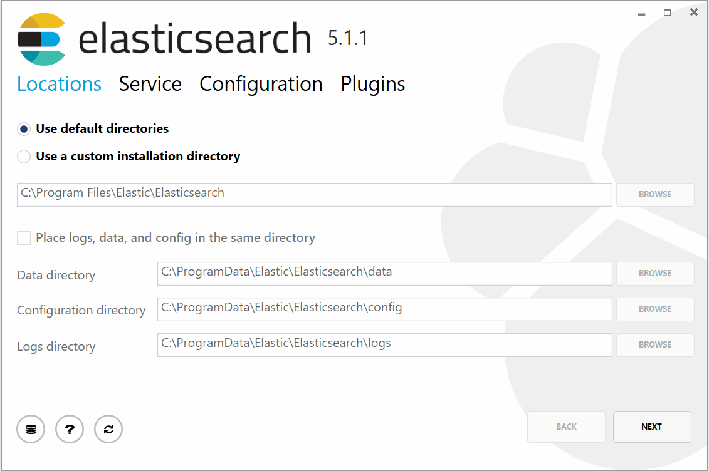

# Windows installers for the Elastic stack

This is the repository for the Elastic stack MSI-based Windows installers.



## Building

Simply clone the repository and run

```bat
build.bat
```

This will download the latest version of the stack (currently only Elasticsearch) and create the MSIs.

You can also specify a specific version

```bat
build.bat 5.1.1
```

There are many other configuration options available, run the following to see them all

```bat
build.bat help
```

**NOTE**: *Building from source should only be done for development purposes.  Only the officially distributed and signed Elastic installer should be used in production. Using an unofficial Elastic installer is not supported.*

## Installing from the command-line

Instead of installing through the UI, it is also possible to perform an installation in "quiet" mode via the command-line using [msiexec](https://technet.microsoft.com/en-us/library/bb490936.aspx?f=255&MSPPError=-2147217396) and passing the `/qn` flag, which will invoke the installer without the UI.  This can be particularly useful for automating deployments.

```bat
start /wait msiexec.exe /i elasticsearch-5.5.0.msi /qn
```

You can also optionally specify a log file

```bat
start /wait msiexec.exe /i elasticsearch-5.5.0.msi /qn /l elastic-install.log
```

All of the configurable options available in the UI are also exposed as command line arguments to `msiexec`:

```bat
start /wait msiexec.exe /i elasticsearch-5.5.0.msi /qn /l elastic-install.log NODENAME=my_node_name CLUSTERNAME=my_cluster_name
```

### Command-line options

| Parameter name                   | Description                      | Default value                    |
| -------------------------------- | -------------------------------- | -------------------------------- |
| INSTALLDIR                       | Elasticsearch installation path, has to end with the current version number, | `%ProgramW6432%`\Elastic\Elasticsearch\6.3.1 |
| DATADIRECTORY                    | Data directory path              | `%ALLUSERSPROFILE%`\Elastic\Elasticsearch\data |
| CONFIGDIRECTORY                  | Config directory path            | `%ALLUSERSPROFILE%`\Elastic\Elasticsearch\config |
| LOGSDIRECTORY                    | Logs directory path              | `%ALLUSERSPROFILE%`\Elastic\Elasticsearch\logs |
| CLUSTERNAME                      | Cluster name                     | elasticsearch |
| NODENAME                         | Node name                        | `%COMPUTERNAME%` |
| UNICASTHOSTS                     | Comma-delimited list of unicast nodes ||
| HTTPPORT                         | Port to use for HTTP communication | 9200 |
| TRANSPORTPORT                    | Port to use for transport (node-to-node communication) | 9300 |
| MINIMUMMASTERNODES               | Minimum number of master eligible nodes | 1 |
| MASTERNODE                       | Whether this node should be master eligible | `true` |
| DATANODE                         | Whether or not to make this a data node     | `true` |
| INGESTNODE                       | Whether or not to make this an ingest node | `true` |
| NETWORKHOST                      | Hostname to bind to and advertise to other nodes | |
| SELECTEDMEMORY                   | Amount of memory to allocate to the JVM | 2GB. If the target machine has less than 4GB RAM, then 50% RAM |
| LOCKMEMORY                       | Whether or not to lock JVM memory           | `false` |
| INSTALLASSERVICE                 | Install as a Windows service                | `true` |
| STARTAFTERINSTALL                | Start the service after install is completed | `true` |
| STARTWHENWINDOWSSTARTS           | Start the service when Windows starts (Automatic) | `true` |
| USELOCALSYSTEM                   | Run the service as the `LOCALSYSTEM` user | `true` |
| USENETWORKSERVICE                | Run the service as the `NETWORKSERVICE` user | `false` |
| USEEXISTINGUSER                  | Run the service as the specified `USER` | `false` |
| USER                             | Existing user to run the service as     ||
| PASSWORD                         | Password for the existing user          ||
| HTTPPROXYHOST                    | Hostname of the HTTP proxy to use when downloading plugins. If specified, this will be the proxy used to download plugins from any HTTP scheme resource ||
| HTTPPROXYPORT                    | Port of the HTTP proxy to use when downloading plugins | 80 |
| HTTPSPROXYHOST                   | Hostname of the HTTPS proxy to use when downloading plugins. If specified, this will be the proxy used to download plugins from any HTTPS scheme resource, including https://artifacts.elastic.co ||
| HTTPSPROXYPORT                   | Port of the HTTPS proxy to use when downloading plugins | 443 |
| PLUGINS                          | Comma-delimited list of plugins to install ||

## Running as a service

If Elasticsearch was installed as a service via the MSI, then it can be controlled using the native Windows [sc](https://technet.microsoft.com/en-us/library/bb490995.aspx) utility.

```bat
sc start Elasticsearch
```

to start the service, or

```bat
sc stop Elasticsearch
```

to stop it.

Configuring Elasticsearch specific settings while running as a service is as simple as editing the `elasticsearch.yml` and `jvm.options` files, and then restarting the service.

## Running from the command-line

In addition to installing and running Elasticsearch as a service, it can also be started from the command-line by calling `elasticsearch.exe` located in the `bin` directory, much like the original `elasticsearch.bat` that's distributed with the zip file.

It also accepts the same command-line arguments as the original bat file.

```bat
./elasticsearch.exe -E cluster.name=my_cluster_name -E node.name=my_node_name
```

## Reporting problems

To report any problems encountered during installation, or to request features, please open an [issue](https://github.com/elastic/windows-installers/issues).  We ask that you please attach the MSI log file if applicable.

When installing from the command-line, the log file can be captured by passing the `/l <logfilename>`.  When installing through the UI, a link to the log file will be provided at the end of the installation.

For general questions and comments, please use the Elastic [discussion forum](https://discuss.elastic.co/).

## Known build issues and fixes

### Checking out through WSL

If you check out this repos through WSL (bash on windows) chances are the case sensitive flag will get set on the checkout folder.
During build WixToolSet uppercases the filenames 

From procmon:

> light.exe    5744    CreateFile    <checkout>\BUILD\IN\ELASTICSEARCH-6.4.0\MODULES\X-PACK-WATCHER\ACTIVATION-1.1.1.JAR  

This will yield a `light.exe : error LGHT0001 : The system cannot find the path specified. (Exception from HRESULT: 0x80070003)` during the `FAKE` build which will then complain it can not find the `msi`.

To fix this run `fsutil.exe file setCaseSensitiveInfo <checkout> disable`


