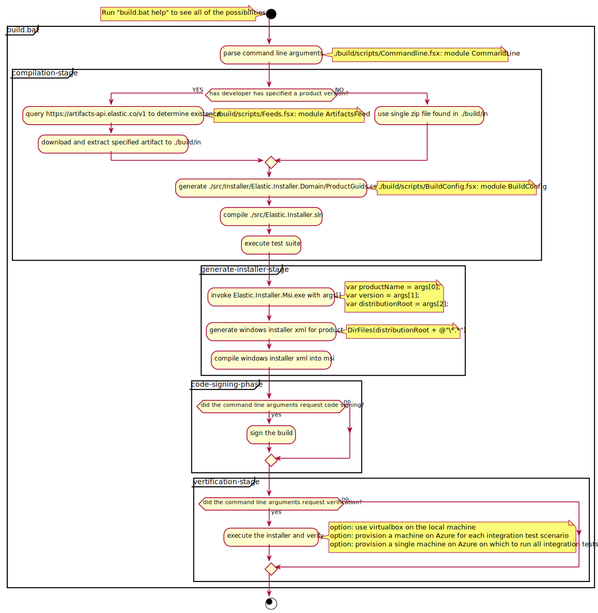

# overview

## build stages

## project structure

### windows installer

### installer hosts

### process hosts

Each product has it's own process host which is an windows executable wrapper can be executed manually by a user or headless as a windows service. Each process host can have custom command line arguments and takes a dependancy on the `Elastic.ProcessHosts` project which is the common library that is shared between all process hosts.

